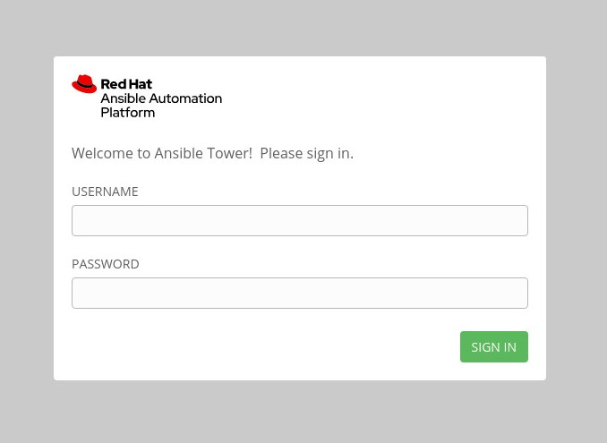
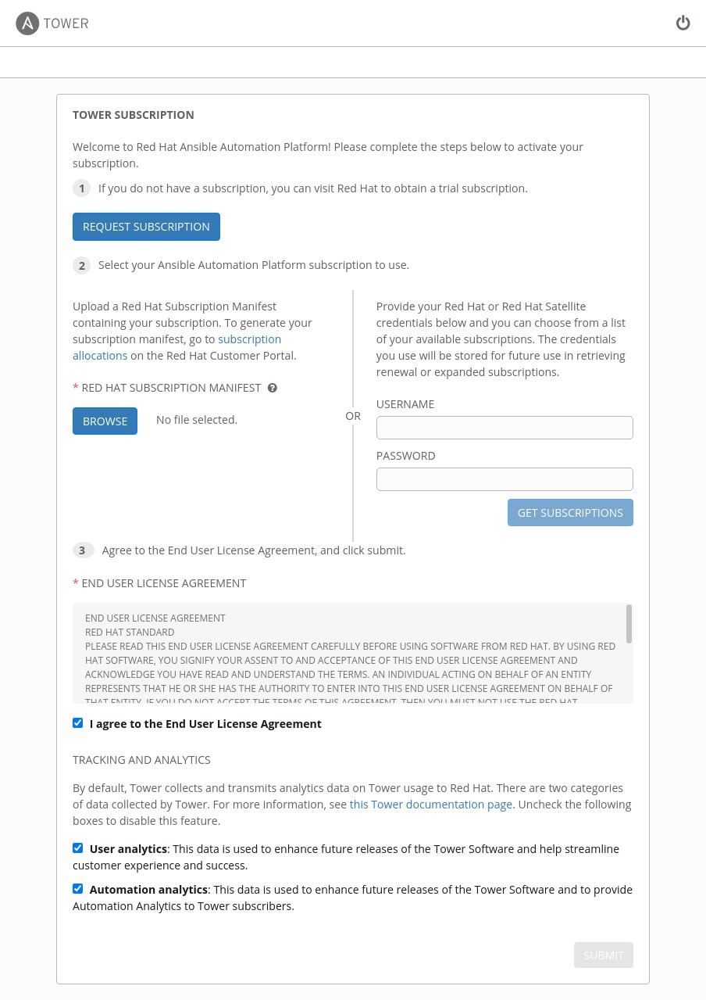
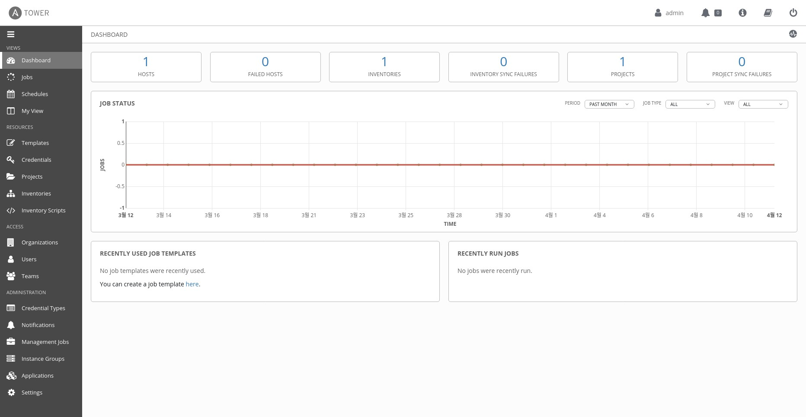

## Ansible Tower Install - 20220412

- RHEL 8.5
- version : 3.8.5-3
- ref.<https://docs.ansible.com/ansible-tower/latest/html/quickinstall/index.html>

### 1. Download Ansible Tower Install

- [Download link](https://releases.ansible.com/ansible-tower/setup/ansible-tower-setup-latest.tar.gz)
- file download and then extract 

~~~
# ls -l
total 178708
drwxr-xr-x. 6 root root       195 Mar 22 11:40 ansible-tower-setup-3.8.5-3
-rw-r--r--. 1 root root   4730488 Apr 12 13:56 ansible-tower-setup-latest.tar.gz
~~~

### 2. Settig up the Inventory File
~~~
...
admin_password='testtest' 
...
pg_password='testtest'
...
~~~

- Inventory setup after and playbook setup (sh setup.sh)
~~~
[root@localhost ansible-tower-setup-3.8.5-3]# ./setup.sh
Updating Subscription Management repositories.
Unable to read consumer identity

This system is not registered with an entitlement server. You can use subscription-manager to register.

Ansible Tower Dependencies Repository -                                   54 kB/s | 526 kB     00:09    
Last metadata expiration check: 0:00:04 ago on Tue 12 Apr 2022 02:20:05 PM KST.
Dependencies resolved.
=========================================================================================================
 Package                   Arch        Version                Repository                            Size
=========================================================================================================
Installing:
 ansible                   noarch      2.9.27-1.el8ae         ansible-tower-dependencies-temp       17 M
Installing dependencies:
 python3-babel             noarch      2.5.1-7.el8            AppStream                            4.8 M
 python3-cffi              x86_64      1.11.5-5.el8           baseos                               238 k
 python3-cryptography      x86_64      3.2.1-5.el8            baseos                               559 k
 python3-jinja2            noarch      2.10.1-3.el8           AppStream                            538 k
 python3-markupsafe        x86_64      0.23-19.el8            AppStream                             39 k
 python3-ply               noarch      3.9-9.el8              baseos                               111 k
 python3-pycparser         noarch      2.14-14.el8            baseos                               109 k
 python3-pytz              noarch      2017.2-9.el8           AppStream                             54 k
 python3-pyyaml            x86_64      3.12-12.el8            baseos                               193 k
 sshpass                   x86_64      >1.06-3.el8ae           ansible-tower-dependencies-temp       27 k
Installing weak dependencies:
 python3-jmespath          noarch      0.9.0-11.el8           AppStream                             45 k

Transaction Summary
=========================================================================================================
Install  12 Packages

Total size: 24 M
Total download size: 17 M
Installed size: 124 M
Downloading Packages:
...

localhost                  : ok=179  changed=88   unreachable=0    failed=0    skipped=86   rescued=0    ignored=2   

The setup process completed successfully.
Setup log saved to /var/log/tower/setup-2022-04-12-14:19:59.log.

~~~

### 4. Access Tower Webbro browser

- 1.Ansible Tower URL: ''https://IPADDRESS''
- 2.Enter USERNAME, PASSSWORD

- 3.You will see Tower Subscription, use your Red Hat credentials(username, password)

- 4.Last Tower Demo play(Template-Demo job Template)

end.
